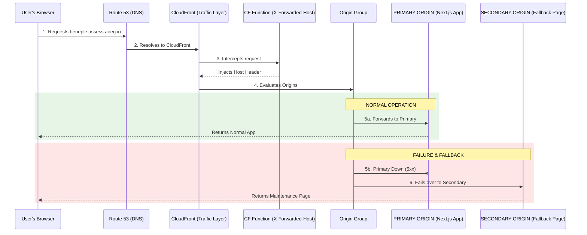

# High Availability & Failover Architecture – Beneple Assess

## 1. Objective
The objective of this implementation is to improve the availability of the Beneple Assess frontend by providing an automatic fallback mechanism when the primary AWS Amplify/Next.js application becomes unavailable. 

The solution uses Amazon CloudFront Origin Groups to automatically switch from the primary Amplify origin to a static fallback page hosted in Amazon S3. The user's URL remains unchanged throughout the failover process.

**Application URL:**
`https://beneple.assess.aoeg.io`

*(Note: This architecture was rigorously validated in our AWS environment using the test domain `https://testfailover.aoeg.io`, the details of which are included below).*

## 2. Architecture Overview

## 3. Components & Test Environment Configuration

The implementation uses a cross-account architecture. Below are the specific resources used during our environment validation.

### Route 53 (Account A: `613205425102`)
Route 53 manages the DNS record for the custom domain. It directs users to the manually managed CloudFront distribution via a CNAME record. Route 53 does not perform the application failover.
*   **Test Hosted Zone:** `aoeg.io`
*   **Test Record:** `testfailover.aoeg.io` pointing to `d3w04x3bhl2mlc.cloudfront.net`

### CloudFront (Account B: `215116348101`)
CloudFront is the main entry point for application traffic. It provides HTTPS termination, CDN capabilities, Origin Group failover, custom error handling, and CloudFront Function integration.
*   **Test Distribution ID:** `ELK3H2E9F80EV`
*   **Test Distribution Domain:** `d3w04x3bhl2mlc.cloudfront.net`
*   **ACM Certificate:** Validated in `us-east-1` (ARN: `...0b9c4ced91d5`)

### Primary Origin – AWS Amplify (Account B)
The primary origin is the existing AWS Amplify/Next.js application. Under normal conditions, users receive the normal application (`HTTP 200`).
*   **Test Primary Origin:** `act-20260908-1.d246slprgvqfid.amplifyapp.com`

### Secondary Origin – Amazon S3 (Account B)
The secondary origin is a private S3 bucket containing the static fallback page (`index.html`). The bucket is private and accessed securely through CloudFront using Origin Access Control (OAC).
*   **Test Fallback Bucket:** `fallback-tast` (Region: `eu-central-1`)

## 4. Normal Traffic Flow
When the application is healthy:
`User` ↓ `beneple.assess.aoeg.io` ↓ `Route 53` ↓ `CloudFront` ↓ `CloudFront Function` ↓ `Amplify` ↓ `Next.js` ↓ `HTTP 200` ↓ `User sees application`

The S3 fallback is not involved.

## 5. CloudFront Origin Group
The CloudFront distribution contains an Origin Group consisting of:
*   **Primary:** AWS Amplify / Next.js
*   **Secondary:** Amazon S3 (`beneple-fallback-assess`)

CloudFront is configured to fail over for the following HTTP status codes:
`500`, `502`, `503`, `504`
These responses indicate that the primary origin has encountered an error or is unavailable.

## 6. Failover Flow
When the primary application fails:
`User` ↓ `Route 53` ↓ `CloudFront` ↓ `Amplify` ↓ `500 / 502 / 503 / 504` ↓ `CloudFront detects failure` ↓ `Origin Group` ↓ `Secondary S3 Origin` ↓ `Fallback Page` ↓ `User`

The important point is that the **DNS record does not need to change during the failure**. The failover happens instantly inside CloudFront.

## 7. Handling Application Routes
The S3 bucket contains only: `index.html`.
Suppose the user was accessing: `https://beneple.assess.aoeg.io/dashboard`

During failover, CloudFront initially requests `/dashboard` from S3. Because `/dashboard` does not exist in the bucket, S3 returns a `403` or `404`.

CloudFront **Custom Error Response** handles this response. Configured behavior:
`403 / 404` ↓ `/index.html` ↓ `503 Service Unavailable`

The user therefore receives the fallback maintenance page while their URL remains: `https://beneple.assess.aoeg.io/dashboard`

## 8. Why HTTP 503 Is Returned
The fallback page is intentionally returned with `HTTP 503 Service Unavailable`. This indicates that the application is temporarily unavailable. 

This is preferable to returning `HTTP 200 OK` for a maintenance page because monitoring systems and search engine crawlers can distinguish a temporary service outage from normal application availability, preserving SEO rankings.

## 9. CloudFront Function (The Header Fix)
A CloudFront Function is attached to the Viewer Request event on the cache behavior. Its purpose is to preserve the original application hostname when requests are forwarded to the Amplify origin.

Conceptually:
`User` `Host: beneple.assess.aoeg.io` ↓ `CloudFront Function` ↓ `X-Forwarded-Host: beneple.assess.aoeg.io` ↓ `Amplify / Next.js`

This prevents the Next.js application from executing 307 absolute redirects to the underlying `*.amplifyapp.com` hostname. The user therefore continues to access the application using the original custom domain without disruption.

## 10. Failover Test Results (AWS Validation Environment)
The implementation was rigorously tested on the `testfailover.aoeg.io` environment by validating normal, failure, and recovery scenarios.

### Test 1 – Normal Application
*   **Expected:** Primary Origin ↓ HTTP 200 ↓ Normal application
*   **Result:** **PASS** (CloudFront function successfully injected the host header, preventing Amplify redirects).

### Test 2 – Primary Origin Failure
The primary application was simulated returning a configured 5xx failure by breaking the primary origin domain in CloudFront.
*   **Expected:** Primary Amplify ↓ 5xx ↓ CloudFront Origin Group ↓ S3 ↓ Fallback Page
*   **Result:** **PASS** (CloudFront timed out connecting to the primary origin and instantly failed over to S3).

### Test 3 – Specific 504 Scenario
The environment previously experienced `HTTP/2 504 x-cache: Error from cloudfront` (Gateway Timeouts). The failover configuration specifically includes HTTP 504.
*   **Expected:** Amplify ↓ 504 ↓ CloudFront ↓ Origin Group ↓ S3 ↓ Maintenance Page
*   **Result:** **PASS** (Verified that 504 explicitly triggered the failover).

### Test 4 – Dynamic Pathing (Custom Error Response)
The user visited `https://testfailover.aoeg.io/en` during a failover event.
*   **Expected:** S3 returns 404 for `/en` ↓ CloudFront Custom Error Response intercepts 404 ↓ Fetches `/index.html` ↓ Returns HTTP 503
*   **Result:** **PASS** (User seamlessly saw the maintenance page on the `/en` path without a URL change).

### Test 5 – Recovery
After the primary application was restored (origin domain fixed in CloudFront):
*   **Expected:** Amplify ↓ HTTP 200 ↓ CloudFront ↓ Primary Origin ↓ Normal Application (No Route 53 DNS modification required).
*   **Result:** **PASS** (CloudFront automatically detected the healthy origin and resumed normal traffic routing).

## 11. Recovery Process
Recovery is automatic. The architecture does not require an administrator to manually change the DNS record when the primary application recovers.

*   **Normal state:** CloudFront ↓ Amplify
*   **During failure:** CloudFront ↓ S3
*   **After recovery:** CloudFront ↓ Amplify

This drastically reduces operational intervention during incidents.

## 12. Key Benefits
1.  **Automatic Failover:** CloudFront automatically handles the transition when a failure response is received.
2.  **Same URL:** Users continue using `https://beneple.assess.aoeg.io`. There is no need to provide a different maintenance URL.
3.  **No DNS Change During Incident:** Route 53 does not need to be modified, bypassing DNS propagation delays.
4.  **Better User Experience:** Instead of exposing generic `502 Bad Gateway` or `504 Gateway Timeout` errors, the user receives a beautifully controlled maintenance page.
5.  **Simple Fallback Infrastructure:** The fallback application is only a static HTML page stored in S3. There is no EC2 server or runtime required.
6.  **Private S3:** The S3 bucket remains private and is accessed through CloudFront using Origin Access Control (OAC).
7.  **Automatic Recovery:** Once the primary application is available, normal traffic resumes without manual intervention.

## 13. Security Configuration
The fallback bucket is strictly configured as a private S3 bucket.
*   **Block Public Access:** ON
*   **Object Ownership:** Bucket owner enforced
*   **Encryption:** SSE-S3
*   **Static Website Hosting:** OFF
*   **CloudFront OAC:** Enabled

CloudFront is the only authorized and controlled access point to the S3 fallback content.

## 14. Why CloudFront Failover Instead of Route 53 Failover?
The original concept was to use Route 53 to switch between two endpoints. However, the application uses AWS Amplify-managed CloudFront infrastructure. The AWS platform prohibits the same production hostname from being associated with multiple CloudFront distributions simultaneously.

Therefore, using a single manually managed CloudFront distribution with an Origin Group provides a much cleaner, compliant architecture:
`Route 53` ↓ `ONE CloudFront` ↓ `Origin Group` 
├── `Primary` → `Amplify`
└── `Secondary` → `S3`

Route 53 remains responsible for DNS, while CloudFront exclusively handles the application-level failover.

## 15. Responsibility of Each AWS Service
*   **Route 53:** DNS resolution
*   **CloudFront:** Traffic routing and failover
*   **CloudFront Function:** Preserve application host/domain context
*   **Amplify:** Primary frontend application
*   **S3:** Static fallback page
*   **API Gateway / Lambda:** Backend APIs and processing
*   **DynamoDB:** Application data

## 16. Final Result
The implemented architecture provides a controlled, automated fallback mechanism for Beneple Assess, significantly reducing the impact of temporary application outages.
*   **Normal operation:** User → Route 53 → CloudFront → Amplify
*   **Failure:** User → Route 53 → CloudFront → S3 Fallback
*   **Recovery:** User → Route 53 → CloudFront → Amplify

No manual DNS change is required during failover or recovery.

---
### AWS References
*   [CloudFront Origin Failover](https://docs.aws.amazon.com/AmazonCloudFront/latest/DeveloperGuide/high_availability_origin_failover.html)
*   [CloudFront Origin Groups](https://docs.aws.amazon.com/AmazonCloudFront/latest/DeveloperGuide/RequestAndResponseBehaviorOriginGroups.html)
*   [CloudFront Origin Access Control](https://docs.aws.amazon.com/AmazonCloudFront/latest/DeveloperGuide/private-content-restricting-access-to-s3.html)
*   [CloudFront Alternate Domain Names](https://docs.aws.amazon.com/AmazonCloudFront/latest/DeveloperGuide/CNAMEs.html)
*   [Route 53 Routing to CloudFront](https://docs.aws.amazon.com/Route53/latest/DeveloperGuide/routing-to-cloudfront-distribution.html)
