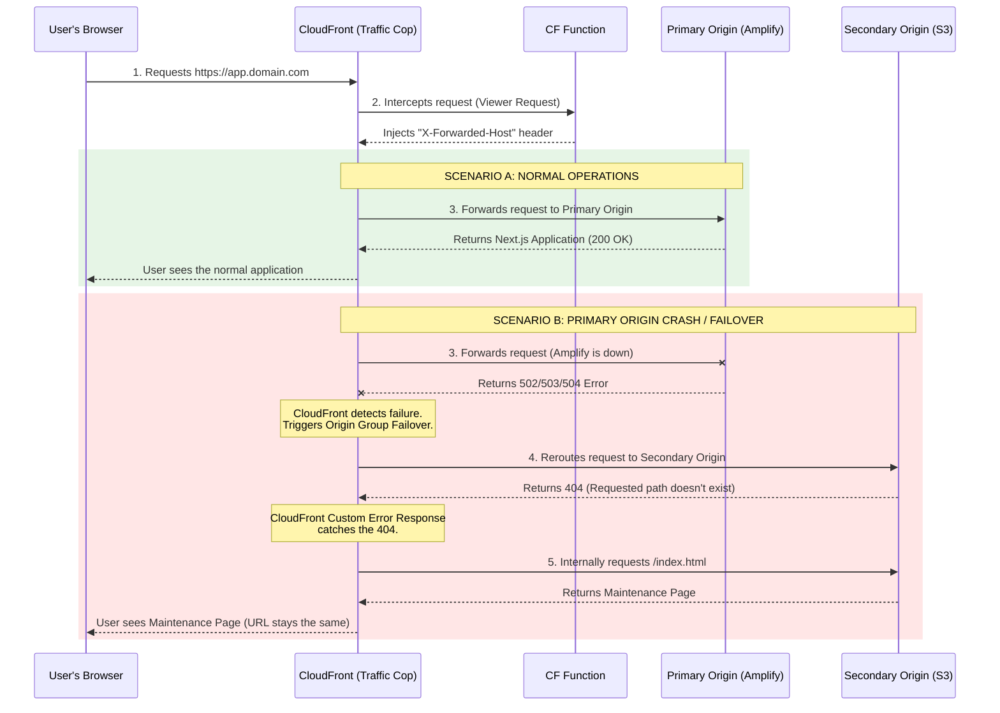

# High Availability & Failover Architecture Guide

## Overview
This document outlines the high-availability failover architecture implemented to ensure maximum uptime for our front-end applications. The architecture ensures that if the primary application server (AWS Amplify/Next.js) experiences downtime, traffic is seamlessly and instantly routed to a static maintenance page hosted on an Amazon S3 bucket, without any changes to the user's URL.

## Architecture Diagram

## Core Components

### 1. Amazon CloudFront (Reverse Proxy)
A manual AWS CloudFront distribution sits in front of all traffic. Instead of pointing Route 53 DNS directly to AWS Amplify, DNS points to this CloudFront distribution. CloudFront acts as the "Traffic Cop" and handles the failover routing logic.

### 2. CloudFront Origin Groups
We utilize CloudFront Origin Groups to define a Primary and Secondary destination for all traffic:
*   **Primary Origin (Amplify):** The main Next.js application.
*   **Secondary Origin (S3):** A highly available Amazon S3 bucket containing a static `index.html` maintenance page.

If CloudFront receives a `500`, `502`, `503`, or `504` error code from the Primary Origin (indicating the server is down or timing out), it automatically and instantly reroutes the request to the Secondary Origin.

### 3. S3 Fallback Bucket & Custom Error Responses
When a user requests a specific path (e.g., `/dashboard`) and a failover occurs, CloudFront asks S3 for `/dashboard`. Because the S3 bucket only contains `index.html`, S3 returns a `404 Not Found` or `403 Forbidden` error. 

To handle this gracefully, the CloudFront distribution is configured with a **Custom Error Response**:
*   **Trigger:** HTTP `403` or `404` from the Origin.
*   **Action:** Internally rewrite the path to `/index.html` and return a `503 Service Unavailable` status code to the client.

This ensures the user sees the beautifully formatted maintenance page, and search engines (like Google) receive a `503` status code, preventing SEO penalties during downtime.

### 4. CloudFront Functions (The Next.js Header Fix)
Next.js applications deployed on AWS Amplify are strict about domain routing. If they receive a request via a reverse proxy without the correct domain context, Next.js will issue an absolute `307 Redirect` to the underlying `.amplifyapp.com` URL. 

To prevent this, a lightweight **CloudFront Function** is attached to the `Viewer Request` event. This function reads the requested domain and injects it into a hidden `X-Forwarded-Host` header. When the request reaches Amplify, Next.js reads this header and correctly renders all internal links and redirects using the custom domain, completely masking the underlying infrastructure.

## Recovery Process
When the Primary Origin (Amplify) comes back online and begins returning `200 OK` responses again, CloudFront automatically stops using the S3 fallback bucket and resumes routing traffic to the primary application. No manual intervention is required for recovery.
